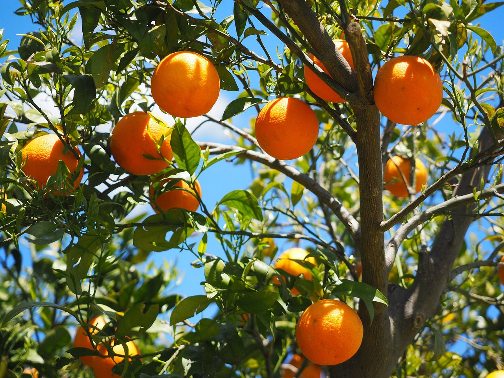

<style>
.forceBreak { -webkit-column-break-after: always; break-after: column; }
.myClass {font-size: 14px;}
</style>

```{css, echo=FALSE}
pre {
  max-height: 700px;
  overflow-y: auto;
}

pre[class] {
  max-height: 500px;
}

.scroll-100 {
  max-height: 500px;
  overflow-y: auto;
  background-color: inherit;
}
```


```{r setup, include=FALSE}
knitr::opts_chunk$set(echo = FALSE)
```

# Oranges

## Le arance {.build}

 <span style="color:magenta"> L'arancia </span>
<font size="3">  è un agrume sempreverde con una vita produttiva di 50-60 anni. 

<div>

Alcuni aranci ben curati possono vivere fino a 100 anni o più. La pianta dell’arancio (Citrus x sinensis) è un membro della famiglia delle Rutacee. 

È un albero che produce fiori e la sua altezza a maturità può variare tra 5 e 15 m.</font>

</div>

</span><font size="3">L’albero è coltivato principalmente per i suoi frutti, ma anche per i suoi fiori e come ornamentale.</font>

## Caratteristiche della pianta {.columns-2} 


<div align=justify></span><font size="3"> Gli aranci, come tutti gli agrumi, sono alberi con un unico tronco centrale. I rami principali normalmente spuntano dal tronco all’altezza di 60-120 cm da terra. Il gambo è cilindrico e la chioma della maggior parte delle cultivar è tipicamente sferica, sebbene la forma possa variare a seconda di come vengono potati gli alberi. Gli aranci, anche se sempreverdi, sono caratterizzati da una tendenza a rinnovare costantemente il loro fogliame. Durante i primi anni fino allo sviluppo completo, la quantità annua di foglie appena formate è superiore a quella delle foglie vecchie che tendono a cadere. Le foglie giovani hanno un colore verde chiaro e gradualmente ricevono un colore verde più profondo.</font>

<p class="forceBreak"></p>

</span><font size="3"> Il <span style="color:purple">frutto è una bacca con buccia di colore arancione e polpa da arancione a rossa a seconda della varietà</span>. Sia la superficie del frutto che quella delle foglie sono ricche di ghiandole oleaginose, che conferiscono all’arancia il suo caratteristico odore. Gli aranci di solito fioriscono in primavera.</font></div>


```{r, fig.cap = "fiori", fig.align="center", out.width="75%"}
knitr::include_graphics(path = "IMG/fiori01.jpg")
```


## Caratteristiche della pianta {.build .columns-2} 

<div style="float: left; width: 70%; text-align: right;">

</span><font size="3"> Gli aranci, come tutti gli agrumi, sono alberi con un unico tronco centrale. I rami principali normalmente spuntano dal tronco all’altezza di 60-120 cm da terra. Il gambo è cilindrico e la chioma della maggior parte delle cultivar è tipicamente sferica, sebbene la forma possa variare a seconda di come vengono potati gli alberi. Gli aranci, anche se sempreverdi, sono caratterizzati da una tendenza a rinnovare costantemente il loro fogliame. </font>

</div>

<p class="forceBreak"></p>

</span><font size="3"> Il frutto è una bacca con buccia di colore arancione e polpa da arancione a rossa a seconda della varietà. Sia la superficie del frutto che quella delle foglie sono ricche di ghiandole oleaginose, che conferiscono all’arancia il suo caratteristico odore. Gli aranci di solito fioriscono in primavera.</font>


```{r, fig.cap = "fiori", fig.align="center", out.width="75%"}
knitr::include_graphics(path = "IMG/fiori01.jpg")
```


##

```{r, fig.cap = "Aranceto", fig.align="center", out.width="75%"}
knitr::include_graphics(path = "IMG/Aranceto01.jpg")
```

## Codice scrollevole

```{r, eval=FALSE, echo=TRUE, class.output="scroll-100"}
shiny::shinyApp(
 ui = fluidPage(
  sidebarLayout(
    sidebarPanel(
      selectInput(inputId = "dataset", # nome dell'input per il server
                  label = "Choose a dataset:", # nome dell'input per lo user
                  choices = c("rock", "pressure")) # opzioni
    ),

    mainPanel(
      plotOutput( #qui voglio un grafico 
        "graph"   
      )
    ) 
  )
),

server = function(input, output){
  output$graph <- renderPlot({
    if(input$dataset == "rock"){ 
      data <- rock
    } else {
      data <- pressure
    } 
    plot(data[, c(1:2)])
  })
}, 
options = list(height = 300)
)
```

